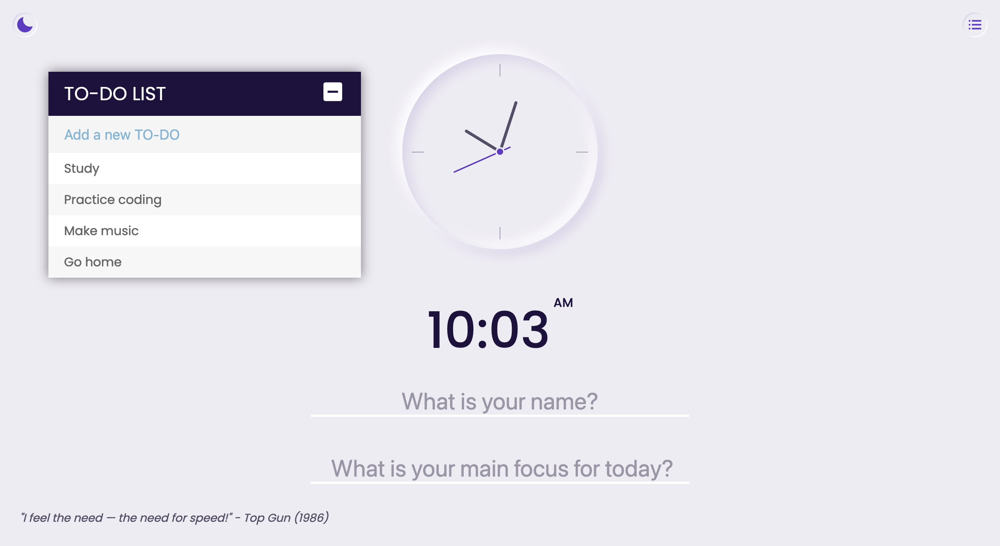

# Momentum App

A minimalist momentum app with neumorphic design that features a clock, a greeting, a focus, a randomly generated quote, and a draggable to-do list.

## Full Design

## Live Demo

Github Page (https://grenzk.github.io/momentum-app/)

## Source

Avion School (https://docs.avionschool.com/avn-mcourse/-MYjabeTubdULkJ4UAcG/extra-projects/project-momentum-app)
